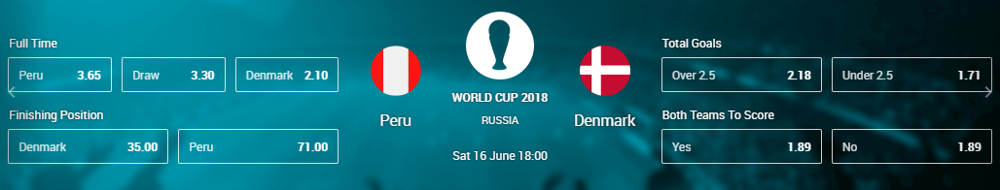

# wc2018-finals-widget



Finals widget is shown pre-match for the Semifinal, Bronze martch and Final. Available both in web browser and mobile but different number of odds are being shown.

## Configuration

Arguments and their default values:
```json
"args": {
  "widgetTrackingName": "wc2018-finals",
  "additionalBetOffersCriterionIds": [
    1001159926,
    1001642858
  ],
  "flagBaseUrl": "https://d1fqgomuxh4f5p.cloudfront.net/tournamentdata/worldcup2018/icons",
  "iconUrl": "https://d1fqgomuxh4f5p.cloudfront.net/tournamentdata/worldcup2018/icons/world_cup_2018.svg",
  "backgroundUrl": "https://d1fqgomuxh4f5p.cloudfront.net/tournamentdata/worldcup2018/overview-bw-bg-desktop.jpg",
  "blendWithOperatorColor": true,
  "fetchData": {
    "baseFilter":"/football/world_cup_2018",
    "qualifyCriterionId": [ 1004240929 ],
    "finalCriterionId": [ 1002978411, 1004240929 ]
  },
  "fetchDates": {
    "quarterFinals": {
      "start": new Date('2018-06-16 00:00 UTC+3'),
      "end": new Date('2018-06-16 23:59 UTC+3')
    },
    "semiFinals": {
      "start": new Date('2018-07-10 00:00 UTC+3'),
      "end": new Date('2018-07-11 23:59 UTC+3')
    },
    "finals": {
      "start": new Date('2018-07-14 00:00 UTC+3')
    }
  }
}
```

1. `widgetTrackingName` - string - tracking name for analytics purposes
2. `additionalBetOffersCriterionIds` - Array<string> - list of criteria ids to display in addition to match outcome and tournament position
3. `flagBaseUrl` - string - url potinting to a directory containing flags of all competitors
4. `iconUrl` - string - url poitning to a file that should be used as an icon
5. `backgroundUrl` - string - url poitning to a file that should be used as a background
6. `blendWithOperatorColor` - boolean - should the background be covered with a colored overlay
7. `fetchData` - Object - containing information regarding which betoffers to display
  1. `baseFilter` - string - url path to tournament
  2. `qualifyCriterionId` - Array<number> - list of tournament events critera ids to display before finals (citeria at the end of the list, if they are available, overwrite those at the begining)
  3. `finalCriterionId` - Array<number> - list of tournament events critera ids to display during finals (citeria at the end of the list, if they are available, overwrite those at the begining)
8. `fetchDates` - Object - containing information regarding date spans of tournament stages
  1. `<stage-name>{ quarterFinals | semiFinals | finals }`
    1. `<stage-date-border>{ start | end }` - Date - date the tournament stage starts of ends

## Bet Offers selection logic

1. Upcoming matches are sorted into groups based on their starting time: quarter finals, semi finals and finals. If there are no lower-level upcoming matches the widget shows the next next stage.
2. Match outcome and up to two other bets specified in `additionalBetOffersCriterionIds` are displayed for all matches.
3. Additionaly one bet offer, matching the participating countries, from tournamet events is displayed. Before finals `qualifyCriterionId` is a source of competition events criteria. During finals `finalCriterionId` is a source of competition events criteria. The widget tries to find any competition bet offers matching the first criterion from the list, then moves to the next. Default criteria correspond to **Tournament Position** bet offer for all matches before finals, and to **Third Place** and **Tournament Position** for the finals.
4. For all matches before finals the widget displays a **Tournament Position** bet offer containing the **Top 2** offer. For the final the **Winner** offer is displayed.

## Build Instructions

Please refer to the [core-library](https://github.com/kambi-sportsbook-widgets/widget-core-library)
